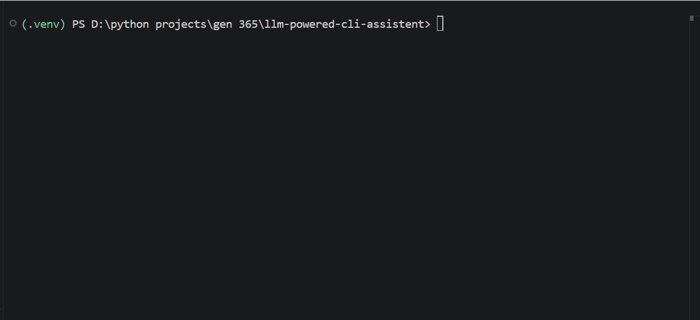

# 🚀 Envora - AI Powered Sustainability CLI Assistant

An AI-powered command-line assistant built with Python and the Gemini API. Envora provides conversational AI with memory, persona support, conversation persistence, and token usage tracking, all from the terminal.

---

## ✨ Features

- 🤖 Chat with Google's Gemini models
- 🧠 Conversation memory
- 📝 Automatic summary memory
- 💾 Save and load conversations
- 👤 Multiple AI personas
- 📊 Token and cost tracking
- ⚡ Interactive CLI commands
- 🎨 Rich terminal output
- 🧪 Unit tested core functions

---

## 🎬 Demo



---

## 🛠 Tech Stack

- Python
- Gemini API
- AsyncIO
- Pydantic
- Typer
- Rich
- Pytest
- python-dotenv
- JSON

---

## 📂 Project Structure

```text
llm-cli-assistant/

├── src/
│   ├── __init__.py
│   ├── app.py
│   ├── commands.py
│   ├── config.py
│   ├── helper.py
│   ├── llm.py
│   ├── logger_config.py
│   ├── main.py
│   ├── memory.py
│   ├── metrics.py
│   ├── models.py
│   ├── personas.py
│   ├── storage.py
│   ├── summary_memory.py
│   ├── prompts/
│     └── system_prompts.py       
│   └── .env    
├── tests/
│   └── test.py
|
├── README.md
├── pyproject.toml
└── requirements.txt
```

---

## 🚀 Installation

Clone the repository

```bash
git clone <https://github.com/codewithgowshik/genai-engineer-365.git>
```

Navigate into the project

```bash
cd llm-cli-assistant
```

Install dependencies

```bash
pip install -r requirements.txt
```

Create a `.env` file

```text
API_KEY=your_gemini_api_key
```

---

## ▶️ Usage

Run directly

```bash
python src/main.py
```

or, after installing

```bash
envora
```

---

## 💻 Available Commands

| Command | Description |
|----------|-------------|
| `/help` | Show all commands |
| `/usage` | Show token usage |
| `/save` | Save conversation |
| `/reset` | Clear conversation memory |
| `/profile teacher` | Change AI persona |
| `/exit` | Exit the application |

---

## 🧪 Running Tests

```bash
pytest
```

---

## 📈 What I Learned

During this project I learned:

- Prompt Engineering
- Gemini API integration
- Async programming with AsyncIO
- Conversation memory
- JSON persistence
- Unit testing with Pytest
- Packaging Python applications
- Building installable CLI tools
- Git and GitHub workflows

